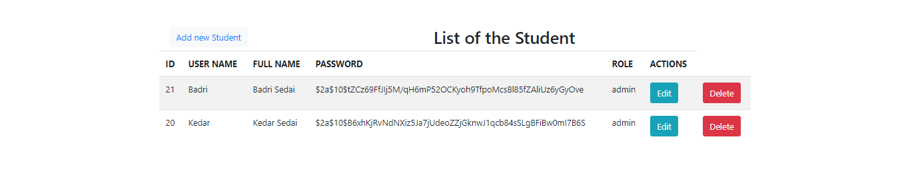
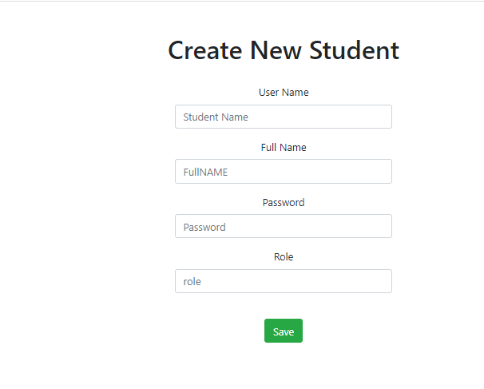

# Student-Record
Keep record of Student 


<!-- ABOUT THE PROJECT -->
## About The Project

Student Record

 This is CRUD Application that is made in SPRING-BOOT  :smile:
 
  This is the landing page
  
  
   This is the page to add new Student
   


### Built With

Following technology are used to make this projejct.
* [Thymeleaf](https://www.thymeleaf.org/)
* [Spring Boot](https://spring.io/projects/spring-boot)
* [Hibernate](https://hibernate.org/)


<!-- GETTING STARTED -->
## Getting Started

This is an example of how you may give instructions on setting up your project locally.
To get a local copy up and running follow these simple example steps.


### Installation

1. Clone the repo
   ```sh
   git clone https://github.com/kedarSedai/Student-Record
   ```
2. You need to have Java installed on your system

<!-- CONTRIBUTING -->
## Contributing

Contributions are what make the open source community such an amazing place to be learn, inspire, and create. Any contributions you make are **greatly appreciated**.

1. Fork the Project
2. Create your Feature Branch (`git checkout -b feature/AmazingFeature`)
3. Commit your Changes (`git commit -m 'Add some AmazingFeature'`)
4. Push to the Branch (`git push origin feature/AmazingFeature`)
5. Open a Pull Request


<!-- CONTACT -->
## Contact

Kedar Sedai- (kedar.sedai05@gmail.com)

Project Link: [https://github.com/kedarSedai/Student-Record]


